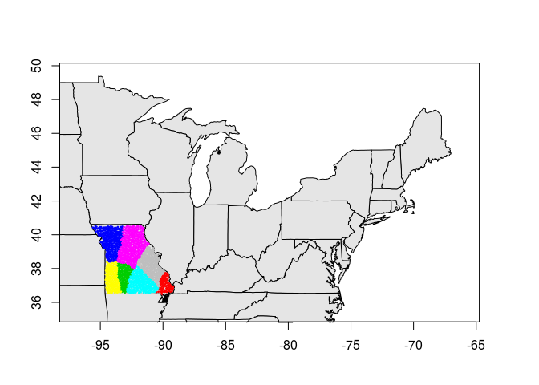

<!-- README.md is generated from README.Rmd. Please edit that file -->
speCluster
==========

[](http://www.repostatus.org/#wip)

This package wraps the code at:

<https://github.com/cont-limno/SpectralClustering4Regions>

Installation
------------

You can install speCluster from github with:

``` r
# install.packages("devtools")
devtools::install_github("cont-limno/speCluster")
```

Usage
-----

### Load package

``` r
library(speCluster)
#> Loading required package: maps
```

### Read data

``` r
dt     <- read.csv("data-raw/dataTerrFW.csv", header = T)
coords <- read.csv("data-raw/latLong18876.csv", header = T)
```

### Prep Input

Here we create a data matrix `dt` where each row is an observation and each column is a variable. In this example, we subset a larger matrix to focus on the US State of Missouri. Uninformative (constant) variables are removed with `rm_constant_columns`. Next, we create a constraint matrix that incorporates information on the spatial dependence among observations.

``` r
# Create data matrix
in_state <- as.character(dt$hu12_states) == "MO"
dt <- dt[in_state, -c(1,2)]
dt <- as.matrix(rm_constant_columns(dt))
colnames(dt) <- NULL

# Create constraint matrix
coords <- as.matrix(coords[in_state,])
colnames(coords) <- NULL
nb <- spdep::dnearneigh(coords, 0, 0.192)
nb <- nb_collapse(nb)
cmat <- neighborMatrix(nb, conFactor = 1)
```

### Generate Clusters

``` r
results <- speCluster(data = dt, conMatrix = cmat, 
                      cluster.number = 10)
#> Warning in produceU(similarity = S, ncol = cluster.number): Type 2
#> algorithm might need more than 4.0 G Ram
summary(results)
#>          Length Class  Mode   
#> clusters 1748   -none- numeric
#> SS          3   -none- list
results$SS
#> $SSW
#> [1] 48691.31
#> 
#> $SSB
#> [1] 16479.08
#> 
#> $SSWlist
#>  [1]    46.00505  5630.85173 10818.91933  5239.74218  3035.68172
#>  [6]  5047.52514   520.56304  2902.38989 11955.39352  3494.24110
head(results$clusters)
#> 1 2 3 4 5 6 
#> 6 6 6 6 6 6
mapping(lat = coords[,1], long = coords[,2],
         clusters = results$clusters)
```


### Generate Hierarchical Clusters

``` r
results <- hspeCluster(data = dt, conMatrix = cmat, 
                      cluster.number = 10)
#> Warning in produceU(similarity = S, ncol = 2): Type 2 algorithm might need
#> more than 4.0 G Ram
#> SSW:  46.00505 63363.06NULL
#> iter=3, split cluster 2
#> Warning in produceU(similarity = S, ncol = 2): Type 2 algorithm might need
#> more than 4.0 G Ram
#> SSW:  46.00505 24704.26 33628.23NULL
#> iter=4, split cluster 3
#> Warning in produceU(similarity = S, ncol = 2): Type 2 algorithm might need
#> more than 4.0 G Ram
#> SSW:  46.00505 24704.26 13155.48 16824.34NULL
#> iter=5, split cluster 2
#> Warning in produceU(similarity = S, ncol = 2): Type 2 algorithm might need
#> more than 4.0 G Ram
#> SSW:  46.00505 10456.92 13155.48 16824.34 11337.36NULL
#> iter=6, split cluster 4
#> Warning in produceU(similarity = S, ncol = 2): Type 2 algorithm might need
#> more than 4.0 G Ram
#> SSW:  46.00505 10456.92 13155.48 7124.04 11337.36 9108.891NULL
#> iter=7, split cluster 3
#> Warning in produceU(similarity = S, ncol = 2): Type 2 algorithm might need
#> more than 4.0 G Ram
#> SSW:  46.00505 10456.92 5476.909 7124.04 11337.36 9108.891 7032.887NULL
#> iter=8, split cluster 5
#> Warning in produceU(similarity = S, ncol = 2): Type 2 algorithm might need
#> more than 4.0 G Ram
#> SSW:  46.00505 10456.92 5476.909 7124.04 2943.372 9108.891 7032.887 7217.037NULL
#> iter=9, split cluster 2
#> Warning in produceU(similarity = S, ncol = 2): Type 2 algorithm might need
#> more than 4.0 G Ram
#> SSW:  46.00505 9633.592 5476.909 7124.04 2943.372 9108.891 7032.887 7217.037 512.3814NULL
#> iter=10, split cluster 2
#> Warning in produceU(similarity = S, ncol = 2): Type 2 algorithm might need
#> more than 4.0 G Ram
summary(results)
#>          Length Class  Mode   
#> clusters 15732  -none- numeric
#> SS           3  -none- list
results$SS
#> $SSW
#> [1] 48095.76
#> 
#> $SSB
#> [1] 17074.63
#> 
#> $SSWlist
#>  [1]   46.00505 7052.94983 5476.90859 7124.04009 2943.37179 9108.89082
#>  [7] 7032.88699 7217.03682  512.38137 1581.28940
head(results$clusters)
#>      [,1] [,2] [,3] [,4] [,5] [,6] [,7] [,8] [,9]
#> [1,]    2    3    3    3    3    7    7    7    7
#> [2,]    2    3    3    3    3    7    7    7    7
#> [3,]    2    3    3    3    3    7    7    7    7
#> [4,]    2    3    3    3    3    7    7    7    7
#> [5,]    2    3    3    3    3    7    7    7    7
#> [6,]    2    3    3    3    3    7    7    7    7
mapping(lat = coords[,1], long = coords[,2],
         clusters = results$clusters[,ncol(results$clusters)])
```



Citation
--------

*Creating Multithemed Ecological Regions for Macroscale Ecology* ([Cheruvelil et al. 2017](https://dx.doi.org/10.1002/ece3.2884))
