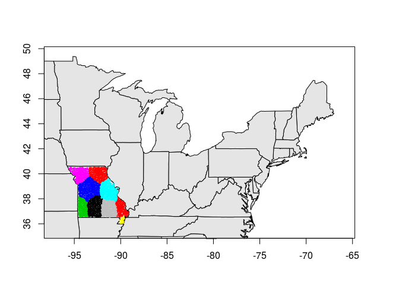

<!-- README.md is generated from README.Rmd. Please edit that file -->
speCluster
==========

[](http://www.repostatus.org/#wip)

This package wraps the code at:

<https://github.com/cont-limno/SpectralClustering4Regions>

Installation
------------

You can install speCluster from github with:

``` r
# install.packages("devtools")
devtools::install_github("jsta/speCluster")
```

Usage
-----

### Load package

``` r
library(speCluster)
#> Loading required package: maps
```

### Read data

``` r
dt     <- read.csv("data-raw/dataTerrFW.csv", header = T)
coords <- read.csv("data-raw/latLong18876.csv", header = T)
```

### Prep Input

``` r
in_state <- as.character(dt$hu12_states) == "MO"
dt <- dt[in_state, -c(1,2)]
dt <- as.matrix(rm_constant_columns(dt))
coords <- as.matrix(coords[in_state,])

colnames(coords) <- NULL
colnames(dt) <- NULL

nb <- spdep::dnearneigh(coords, 0, 0.192)
nb <- nb_collapse(nb)

cmat <- neighborMatrix(nb, conFactor = 1)
```

### Generate Clusters

``` r
results <- speCluster(data = dt, conMatrix = cmat, 
                      cluster.number = 10)
#> Warning in produceU(similarity = S, ncol = cluster.number): Type 2
#> algorithm might need more than 4.0 G Ram
summary(results)
#>          Length Class  Mode   
#> clusters 1748   -none- numeric
#> SS          2   -none- list
results$SS
#> $SSW
#> [1] 48691.31
#> 
#> $SSB
#> [1] 16479.08
head(results$clusters)
#>  1  2  3  4  5  6 
#> 10 10 10 10 10 10
mapping(lat = coords[,1], long = coords[,2],
         clusters = results$clusters)
```



Citation
--------

*Creating Multithemed Ecological Regions for Macroscale Ecology* ([Cheruvelil et al. 2017](https://dx.doi.org/10.1002/ece3.2884))
